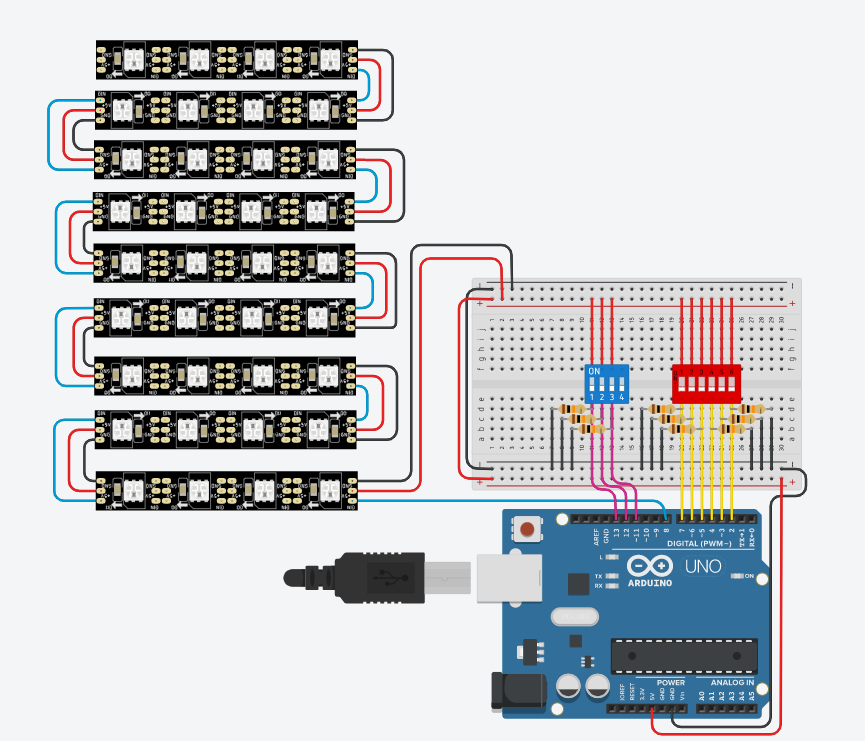
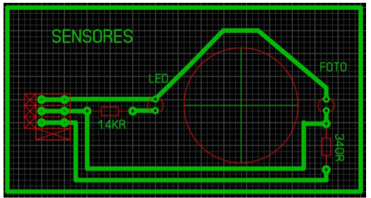

# Arduino-actions

# Nome do projeto

Future Tic Tac Toe 

## Hardware Necessario
              
Fita LED endereçável            

Sensores TCRT 5000

Resistência 15k Ω                       

Resistência 330 Ω                  

Resistência 10k Ω 

Fio multifilar                     

Arduíno Uno R3                      

ATMega328p

## Circuito

O nosso atual circuito do Arduíno
 
 

## Esquema

E aqui temos uns exemplos de esquemas e imagens do projeto Future Tic Tac Toe 

